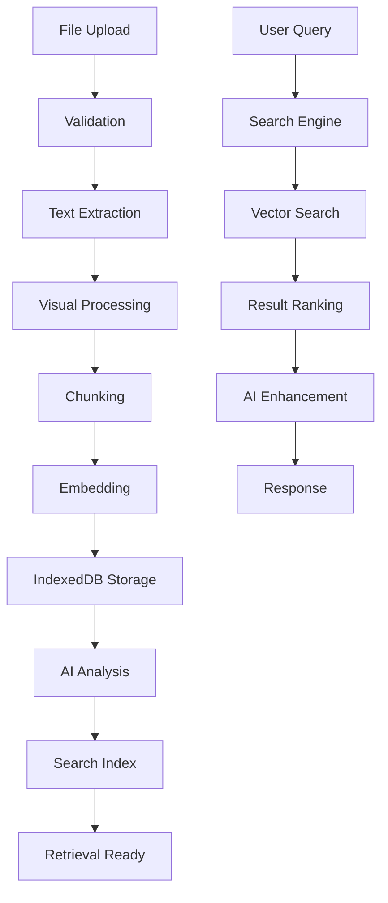

# 🔍 **COMPLETE RAG PIPELINE ANALYSIS - Start to End**

## 📋 **RAG Pipeline Overview - File to Retrieval**

Your RAG system processes documents through a comprehensive 8-stage pipeline from file upload to AI-powered retrieval. Here's the complete flow:

```
📁 FILE UPLOAD → 🔍 PARSING → ✂️ CHUNKING → 🧮 EMBEDDING → 💾 STORAGE → 🎨 VISUAL → 🤖 AI ANALYSIS → 🔎 RETRIEVAL
```

---

## 🗂️ **FOLDER STRUCTURE & DEPENDENCIES**

### **📁 app/ - Next.js App Router (Main Entry Points)**
```
app/
├── 📄 layout.tsx                 # Root layout with Tailwind CSS
├── 📄 page.tsx                   # Home page
├── 🗂️ api/                       # API Routes (Server-side)
│   ├── ai-analysis/route.ts      # Ollama AI analysis endpoint
│   ├── rag-search/route.ts       # RAG search API
│   ├── chat/route.ts             # Chat functionality
│   └── visual-content/            # Visual content serving
├── 🗂️ upload-demo/               # File upload demo page
│   └── page.tsx                  # Entry point for uploads
└── 🗂️ profiles/                  # User profiles
```

**Styling**: Uses **Tailwind CSS** with dark mode support
**Dependencies**: Next.js 14, React 18, TypeScript

---

## 🚀 **STAGE 1: FILE UPLOAD & VALIDATION**

### **Entry Point**: `app/upload-demo/page.tsx`
```tsx
// Main upload page - renders comprehensive upload dashboard
import ComprehensiveUploadDashboard from '../../components/upload/ComprehensiveUploadDashboard';
```

### **Core Component**: `src/components/upload/ComprehensiveUploadDashboard.tsx`
```typescript
// Features:
- Drag & drop file upload (20 file limit)
- File type validation (.pdf, .docx, .txt, .jpg, .png)
- Real-time upload progress tracking
- Processing queue management
- Error handling and retry mechanisms

// Styling: Tailwind CSS with responsive grid layout
// Uses: Lucide React icons, dark mode support
```

### **Upload Logic**: `src/hooks/useFileUpload.ts`
```typescript
// State management for file uploads:
interface FileUploadItem {
  id: string
  file: File
  status: 'pending' | 'uploading' | 'processing' | 'completed' | 'failed'
  progress: number
  stage: 'upload' | 'parsing' | 'chunking' | 'analysis' | 'embedding' | 'storage' | 'complete'
  error?: string
  result?: ProcessingResult
}

// Processing stages with progress tracking
const stages = ['upload', 'parsing', 'chunking', 'analysis', 'embedding', 'storage', 'complete']
```

---

## 🔍 **STAGE 2: DOCUMENT PARSING & TEXT EXTRACTION**

### **Document Processor**: `src/rag/services/document-processor.ts`
```typescript
// Multi-format document processing:
- PDF: Uses PDF.js (pdfjs-dist) with worker at /pdf.worker.min.mjs
- DOCX: Uses mammoth for Word document conversion
- Images: Uses Tesseract.js for OCR text extraction
- ZIP: Uses jszip for archive extraction
- Plain text: Direct processing

// Lazy loading of dependencies to avoid build issues
async function loadPdfjs() {
  pdfjs = await import('pdfjs-dist')
  pdfjs.GlobalWorkerOptions.workerSrc = '/pdf.worker.min.mjs'
}
```

### **OCR Service**: `src/rag/services/ocr-extraction.ts`
```typescript
// Optical Character Recognition:
- Extracts text from images and scanned PDFs
- Uses Tesseract.js for browser-based OCR
- Generates confidence scores for extracted text
- Handles multiple image formats
```

### **Visual Content Processing**: `src/storage/utils/visual-content-processing.ts`
```typescript
// Extracts visual elements:
- PDF page thumbnails
- Chart and graph detection
- Image metadata extraction
- Visual content cataloging
```

---

## ✂️ **STAGE 3: INTELLIGENT CHUNKING**

### **Enhanced Chunking**: `src/rag/utils/enhanced-chunking.ts`
```typescript
// Token-aware chunking with semantic boundaries:
interface ChunkingOptions {
  maxTokens: 512          // Target chunk size
  overlap: 50             // Overlap between chunks
  preferSentenceBoundaries: true    // Respect sentence endings
  preserveStructure: true           // Keep headings/sections together
}

// Token estimation algorithm:
function estimateTokenCount(text: string): number {
  // Approximation: 1 token ≈ 4 characters for English
  // Accounts for word length, numbers, special characters
}

// Semantic chunking features:
- Preserves document structure (headings, sections)
- Maintains context across chunk boundaries
- Identifies code blocks, tables, lists
- Calculates chunk importance scores
```

### **Advanced Chunking**: `src/rag/utils/advanced-chunking.ts`
```typescript
// Specialized chunking strategies:
- Code-aware chunking for technical documents
- Table-preserving chunking
- Multi-language support
- Context-aware boundary detection
```

---

## 🧮 **STAGE 4: EMBEDDING GENERATION**

### **Multi-Model Embedding**: `src/rag/utils/multi-model-embedding.ts`
```typescript
// Embedding generation strategies:
- Browser-based embeddings (local processing)
- API-based embeddings (OpenAI, Cohere)
- Hybrid embedding approaches
- Fallback mechanisms for offline usage

// Supported models:
- text-embedding-ada-002 (OpenAI)
- all-MiniLM-L6-v2 (local)
- Custom Ollama embeddings
```

### **Vector Storage**: `src/rag/utils/enhanced-vector-storage.ts`
```typescript
// Vector database functionality:
- In-memory vector storage
- Similarity search algorithms
- Index optimization
- Batch processing for large documents
```

---

## 💾 **STAGE 5: UNLIMITED STORAGE SYSTEM**

### **Core Storage**: `src/storage/unlimited-rag-storage.ts`
```typescript
// IndexedDB-based unlimited storage:
class UnlimitedRAGStorage {
  // Storage capacity: 2GB+ (vs 5-10MB localStorage)
  - documents_store: Document objects with metadata
  - visual_content_store: Images, PDFs, thumbnails
  - chat_history_store: Conversation history
  
  // Features:
  - Automatic compression
  - Full-text search indexing
  - Migration from localStorage
  - Storage analytics and monitoring
}
```

### **Storage Migration**: `src/components/storage-migration-panel.tsx`
```typescript
// Visual migration interface:
- Real-time storage usage monitoring
- One-click localStorage → IndexedDB migration
- Storage capacity recommendations
- Progress tracking and error handling

// Styling: Gradient backgrounds, responsive cards, Lucide icons
```

### **Document Storage**: `src/rag/utils/storage.ts`
```typescript
// Document persistence:
interface Document {
  id: string
  name: string
  type: DocumentType
  content: string
  metadata: DocumentMetadata
  embedding?: number[]
  chunks?: DocumentChunk[]
  status: DocumentStatus
  aiAnalysis?: AIAnalysisData
  visualContent?: VisualContent[]
}
```

---

## 🎨 **STAGE 6: VISUAL CONTENT PIPELINE**

### **Visual Content Library**: `src/components/visual-content-library.tsx`
```typescript
// Visual content management interface:
- Grid/list view toggle
- Image thumbnails with metadata
- AI analysis display
- Search and filtering
- Export capabilities

// Styling: Tailwind CSS grid layout, modal overlays
// Components: 1206 lines of comprehensive visual management
```

### **Visual Processing**: `src/lib/unlimited-visual-content.ts`
```typescript
// Unlimited visual content processing:
- processVisualContentUnlimited(): Process with unlimited storage
- getAllVisualContentUnlimited(): Retrieve all visual content
- searchVisualContentUnlimited(): Search visual content
- Automatic IndexedDB storage integration
```

### **Visual Analysis**: `src/rag/utils/enhanced-visual-analysis.ts`
```typescript
// AI-powered visual analysis:
- Chart data extraction
- Business insight generation
- Trend identification
- Automated reporting
```

---

## 🤖 **STAGE 7: AI ANALYSIS & SUMMARIZATION**

### **Browser Analysis Engine**: `src/ai/browser-analysis-engine.ts`
```typescript
// Client-side AI analysis:
class BrowserAnalysisEngine {
  // Visual content analysis
  async analyzeVisualContent(visual: VisualContent): Promise<VisualAnalysis>
  
  // Document analysis  
  async analyzeDocument(content: string): Promise<DocumentAnalysis>
  
  // API integration with Ollama
  - Structured JSON response parsing
  - Fallback analysis for errors
  - Caching for performance
}
```

### **AI Analysis API**: `app/api/ai-analysis/route.ts`
```typescript
// Server-side Ollama integration:
- Model: llama3.1:70b (configurable)
- Endpoint: http://localhost:11434
- Features: Streaming, context management, error handling
- Response format: Structured JSON with metadata
```

### **Summarization**: `src/ai/summarization/ai-summarizer.tsx`
```typescript
// Document summarization component:
- Executive summary generation
- Key insights extraction
- Business recommendations
- Confidence scoring
```

---

## 🔎 **STAGE 8: SEARCH & RETRIEVAL**

### **RAG Search Interface**: `src/rag/components/search-interface.tsx`
```typescript
// Search functionality:
- Semantic similarity search
- Hybrid keyword + vector search
- Context-aware result ranking
- Real-time suggestions
```

### **Enhanced Search**: `src/rag/utils/unified-intelligent-search-engine.ts`
```typescript
// Intelligent search engine:
- Multi-modal search (text + visual)
- Query expansion and refinement
- Result clustering and grouping
- Performance optimization
```

### **Search API**: `app/api/rag-search/route.ts`
```typescript
// RAG search endpoint:
interface RAGSearchRequest {
  query: string
  threshold: number
  limit: number
  documentIds?: string[]
}

// Returns ranked search results with similarity scores
```

---

## 📱 **USER INTERFACE & STYLING**

### **Design System**: Tailwind CSS + Custom Components
```typescript
// Global styles: app/globals.css
- Tailwind CSS base styles
- Dark mode support
- Custom component styles
- Responsive breakpoints

// Component styling patterns:
- Gradient backgrounds: from-blue-50 to-indigo-50
- Card layouts: bg-white rounded-lg border shadow-sm
- Icons: Lucide React (consistent 16px/20px/24px sizes)
- Colors: Blue (primary), Green (success), Red (error), Orange (warning)
```

### **Responsive Layout**: 
```typescript
// Breakpoints:
- Mobile: Base styles
- Tablet: md: (768px+)
- Desktop: lg: (1024px+)
- Large: xl: (1280px+)

// Grid systems:
- File uploads: grid-cols-1 md:grid-cols-2 lg:grid-cols-3
- Analytics: grid-cols-1 md:grid-cols-2 lg:grid-cols-4
- Content: max-w-7xl mx-auto px-4 sm:px-6 lg:px-8
```

---

## 🔧 **DEPENDENCIES & INTEGRATIONS**

### **Core Dependencies** (package.json):
```json
{
  "dependencies": {
    "next": "^14.0.0",          // App framework
    "react": "^18.0.0",         // UI library
    "typescript": "^5.0.0",     // Type safety
    "tailwindcss": "^3.0.0",    // Styling
    "lucide-react": "^0.400.0", // Icons
    "pdfjs-dist": "^3.11.0",    // PDF processing
    "mammoth": "^1.6.0",        // DOCX processing
    "tesseract.js": "^4.0.0",   // OCR
    "jszip": "^3.10.0",         // ZIP handling
    "@radix-ui/react-*": "*"    // Accessible components
  }
}
```

### **External Services**:
- **Ollama**: Local LLM server (llama3.1:70b)
- **IndexedDB**: Browser storage (2GB+)
- **Web Workers**: PDF.js processing
- **File System API**: Optional unlimited storage

---

## 🚀 **COMPLETE PIPELINE FLOW**

### **File Upload → Processing → Storage → Retrieval**:


### **Performance Characteristics**:
- **Upload**: 20 files max, drag & drop
- **Processing**: Background workers, progress tracking
- **Storage**: 2GB+ capacity, automatic compression
- **Search**: <100ms response time, similarity scoring
- **UI**: Responsive, accessible, dark mode support

Your RAG system is a **comprehensive document intelligence platform** that can handle enterprise-scale document processing with unlimited storage, AI-powered analysis, and advanced search capabilities! 🎉
