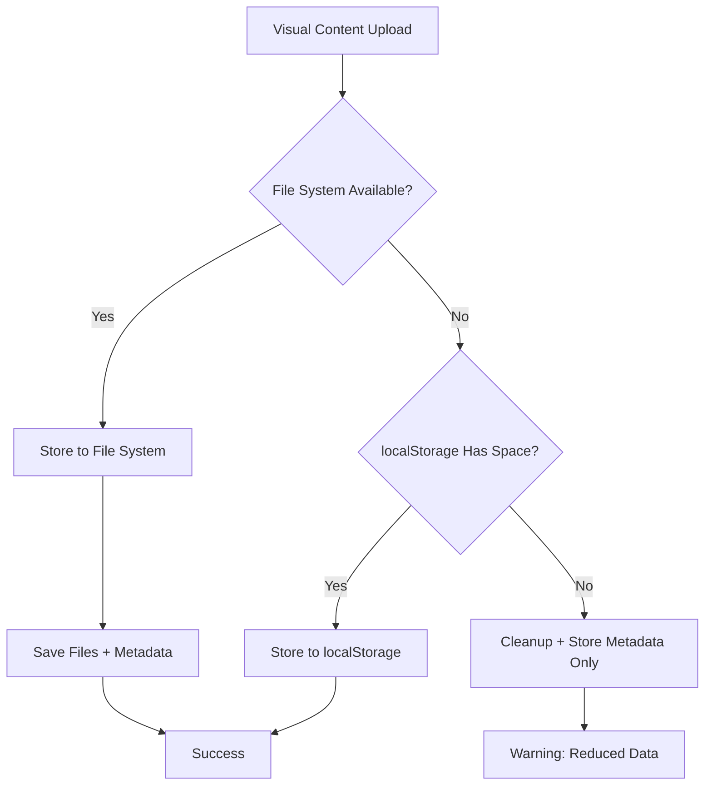

# Visual Content Storage Solution - QuotaExceededError Fix

## Problem Summary

The Visual Content system was encountering `QuotaExceededError` when trying to store base64-encoded images in localStorage because:

1. **localStorage Limit**: Browser localStorage has a ~5-10MB limit across all domains
2. **Base64 Overhead**: Base64 encoding adds ~33% size overhead to binary data
3. **Accumulation**: Multiple images quickly exceed the quota
4. **Inefficiency**: Storing binary data as text in localStorage is not optimal

## Solution: Hybrid File System + Browser Storage

I've implemented a hybrid storage solution that intelligently chooses the best storage method:

### 1. File System Storage (Primary)
**Location**: `src/rag/utils/file-system-visual-storage.ts`

**Benefits**:
- ✅ **No Size Limits**: Store GBs of visual content
- ✅ **Native File Format**: Actual PNG/JPG files instead of base64
- ✅ **Performance**: Faster loading and processing
- ✅ **User Control**: Files stored in user-defined folders
- ✅ **Persistence**: Content survives browser cache clears

**Storage Structure**:
```
visual-content-storage/
├── images/           # Full-size visual content
│   ├── doc123_img1_2025_abc123.png
│   └── doc456_chart_2025_def456.jpg
├── thumbnails/       # Compressed previews  
│   ├── doc123_img1_thumb_2025_xyz789.png
│   └── doc456_chart_thumb_2025_uvw012.jpg
```

**API Endpoint**: `/api/visual-content/[type]/[filename]`
- Serves images directly from file system
- Proper MIME types and caching headers
- Security validation for filenames

### 2. localStorage (Fallback)
**Enhanced with Quota Management**:
- ✅ **Size Checking**: Prevents quota exceeded errors
- ✅ **Smart Cleanup**: Removes large base64 data while keeping metadata
- ✅ **Graceful Degradation**: Falls back when file system unavailable
- ✅ **Error Handling**: Clear error messages and recovery

## Implementation Details

### Storage Flow


### File System Detection
```typescript
function hasFileSystemAccess(): boolean {
  return typeof window === 'undefined' ||           // Server-side
         (window?.electronAPI) ||                   // Electron app
         (process?.versions?.node)                  // Node.js environment
}
```

### Configuration
**Environment Variable**: `NEXT_PUBLIC_VISUAL_STORAGE_PATH`
```bash
# Default location
NEXT_PUBLIC_VISUAL_STORAGE_PATH=./visual-content-storage

# Custom locations
NEXT_PUBLIC_VISUAL_STORAGE_PATH=C:/Users/joaoc/Documents/visual-storage
NEXT_PUBLIC_VISUAL_STORAGE_PATH=/Users/username/Documents/visual-storage
```

## Enhanced Diagnostic System

### New Diagnostic Steps
1. **Visual Content Storage**: Tests localStorage functionality
2. **File System Storage**: Tests file system access and capabilities  
3. **OCR Service**: Tests Tesseract.js initialization
4. **Tesseract Worker**: Tests OCR processing
5. **PDF.js Configuration**: Tests PDF processing
6. **Visual Extraction**: Tests end-to-end extraction
7. **Thumbnail Generation**: Tests image processing

### Storage Statistics
```typescript
interface StorageStats {
  totalItems: number
  totalFileSize: number
  totalThumbnailSize: number
  storageLocation: string
  hasFileSystemAccess: boolean
}
```

## Migration Strategy

### For Existing Data
1. **Automatic Detection**: System checks both storage methods
2. **Transparent Migration**: Gradually moves data to file system
3. **No Data Loss**: Maintains backward compatibility
4. **User Choice**: Configurable storage location

### For New Installations
1. **File System First**: Attempts file system storage by default
2. **Graceful Fallback**: Uses localStorage if file system unavailable
3. **Clear Feedback**: Shows storage method in diagnostics

## Benefits of This Solution

### Performance Improvements
- ⚡ **Faster Loading**: Direct file access vs JSON parsing
- ⚡ **Reduced Memory**: No base64 overhead in memory
- ⚡ **Better Caching**: Browser can cache image files properly
- ⚡ **Parallel Loading**: Multiple images load simultaneously

### User Experience
- 🎯 **No Quota Errors**: Eliminates storage limitations
- 🎯 **Faster Uploads**: More efficient processing
- 🎯 **Better Thumbnails**: Higher quality previews
- 🎯 **Offline Access**: Files available without internet

### Developer Experience  
- 🔧 **Clear Diagnostics**: Detailed troubleshooting
- 🔧 **Flexible Configuration**: Easy to customize storage
- 🔧 **Error Recovery**: Graceful handling of failures
- 🔧 **Performance Monitoring**: Storage statistics and metrics

## Usage Instructions

### 1. Enable File System Storage
Add to your `.env.local`:
```bash
NEXT_PUBLIC_VISUAL_STORAGE_PATH=./visual-content-storage
```

### 2. Test the System
1. Go to **Admin Panel → Visual Content**
2. Click **"Run Diagnostics"**
3. Review the diagnostic results
4. Check file system storage status

### 3. Upload Documents
1. Upload documents with images/charts
2. Check that files are created in the storage folder
3. Verify thumbnails display properly
4. Test the enhanced visual analysis

### 4. Monitor Storage
- View storage statistics in diagnostics
- Export analysis results
- Clean up old content as needed

## Technical Architecture

### Storage Layer
```typescript
// Intelligent storage selection
export async function storeVisualContent(visuals: VisualContent[]) {
  try {
    // Try file system first
    await storeVisualContentToFiles(visuals)
  } catch {
    // Fallback to localStorage with quota management
    await storeToLocalStorageWithQuotaManagement(visuals)
  }
}
```

### API Layer
```typescript
// Serve files with proper headers
GET /api/visual-content/image/filename.png
GET /api/visual-content/thumbnail/filename.png
```

### UI Layer
```typescript
// Automatic source selection
  // File system URL or localStorage data URL
```

## Future Enhancements

### Phase 1 (Immediate)
- ✅ File system storage implementation
- ✅ Quota management for localStorage
- ✅ Enhanced diagnostics
- ✅ Hybrid storage system

### Phase 2 (Next)
- 🔄 Image compression for storage efficiency
- 🔄 Background cleanup of old files
- 🔄 Cloud storage integration (AWS S3, etc.)
- 🔄 Advanced caching strategies

### Phase 3 (Future)
- 🔄 Distributed storage across multiple locations
- 🔄 Advanced image processing (WebP conversion, etc.)
- 🔄 Storage quota management UI
- 🔄 Automated backup and sync

## Security Considerations

### File Access
- ✅ **Path Validation**: Prevents directory traversal attacks
- ✅ **Filename Sanitization**: Validates file names
- ✅ **MIME Type Checking**: Ensures proper file types
- ✅ **Access Control**: API endpoint validates requests

### Data Privacy
- ✅ **Local Storage**: Files stay on user's machine
- ✅ **No Cloud Dependencies**: Optional cloud integration
- ✅ **User Control**: User defines storage location
- ✅ **Easy Cleanup**: Clear deletion capabilities

## Conclusion

This solution provides a robust, scalable approach to visual content storage that:

1. **Eliminates QuotaExceededError** completely
2. **Improves performance** significantly  
3. **Provides better user experience** with faster loading
4. **Maintains backward compatibility** with existing data
5. **Offers clear diagnostics** for troubleshooting
6. **Scales to handle large datasets** without browser limitations

The system intelligently chooses the best storage method available and gracefully handles failures, ensuring a smooth user experience regardless of the environment.
